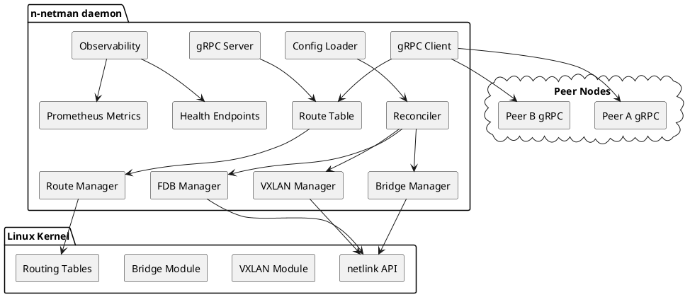
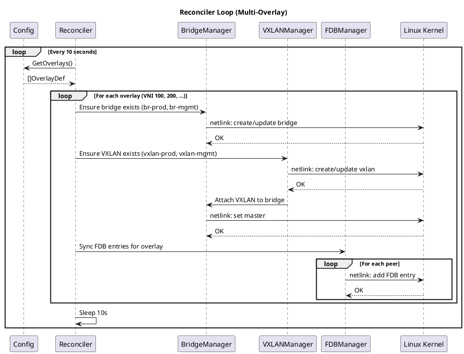
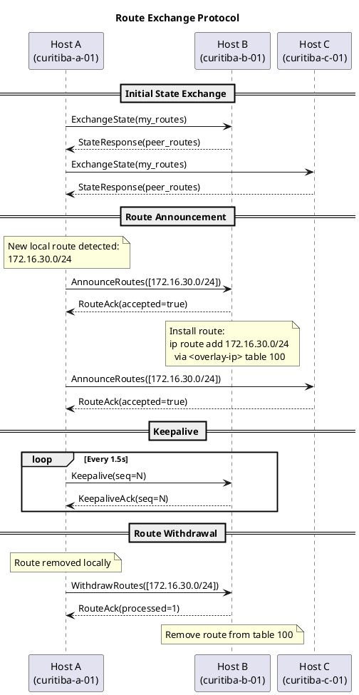
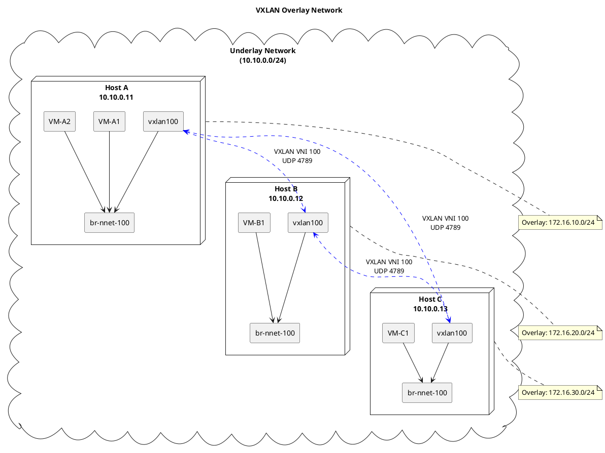

# n-netman — Nishi Network Manager

[](https://golang.org/)
[](LICENSE)

**n-netman** é um agente leve para criação e gerenciamento de **overlays VXLAN L3/L2** entre hosts Linux rodando KVM/libvirt.

## 🎯 Objetivo

Permitir que redes virtuais distribuídas sejam criadas de forma **declarativa e simples**, eliminando a necessidade de soluções complexas como OVS.

### O que já funciona

- ✅ Criação/atualização de interfaces VXLAN e bridges Linux
- ✅ Sincronização de FDB para peers configurados (flooding BUM)
- ✅ BUM em head-end-replication (FDB) e multicast (grupo IP)
- ✅ **Troca de rotas via gRPC** (ExchangeState, AnnounceRoutes, WithdrawRoutes)
- ✅ Instalação automática de rotas recebidas no kernel
- ✅ CLI `nnet` com `apply`, `status`, `routes`, `doctor`, `version`
- ✅ Carregamento/validação de config YAML com defaults
- ✅ Healthchecks HTTP e endpoint de métricas
- ✅ **Status real dos peers** via endpoint `/status` (healthy/unhealthy/disconnected)
- ✅ **Estatísticas de rotas** (exported, installed, per-peer)
- ✅ **Cleanup automático** de rotas no shutdown e quando peers caem (`flush_on_peer_down`)
- ✅ **Multi-Overlay (v2)** — Múltiplos VXLANs com configuração de routing por overlay
- ✅ Bridge com IPv4/IPv6 por overlay (para nexthop e anúncios)

### Em progresso

- ⚠️ TLS para comunicação gRPC entre peers
- ⚠️ Integração libvirt/attach de VMs
- ⚠️ Netplan parsing e rotas conectadas/estáticas

---

## 📋 Pré-requisitos

### Sistema Operacional
- Linux com kernel 3.7+ (suporte a VXLAN)
- Testado em Ubuntu 22.04+, Debian 12+

### Dependências
```bash
# Verificar suporte a VXLAN e bridges
lsmod | grep vxlan
lsmod | grep bridge

# Se não estiverem carregados:
sudo modprobe vxlan
sudo modprobe bridge
```

### Build
- Go 1.23 ou superior

```bash
# Verificar versão do Go
go version
```

---

## 🚀 Instalação

### Opção 1: Build do Fonte

```bash
# Clonar repositório
git clone https://github.com/nishisan-dev/n-netman.git
cd n-netman

# Build
make build

# Ou manualmente:
go build -o bin/nnetd ./cmd/nnetd
go build -o bin/nnet ./cmd/nnet
```

### Opção 2: Instalação no Sistema

```bash
# Build e instalar em $GOPATH/bin
make install

# Ou copiar manualmente
sudo cp bin/nnetd /usr/local/bin/
sudo cp bin/nnet /usr/local/bin/
```

---

## ⚙️ Configuração

### Criar Diretório de Configuração

```bash
sudo mkdir -p /etc/n-netman
```

### Arquivo de Configuração

Crie o arquivo `/etc/n-netman/n-netman.yaml`:

```yaml
version: 1

node:
  id: "host-a-01"          # Identificador único deste nó
  hostname: "host-a"
  tags:
    - "datacenter-1"
    - "kvm"

# Integração com netplan (somente leitura)
netplan:
  enabled: true
  underlay:
    prefer_interfaces:
      - "eth0"
      - "ens3"
    prefer_address_families:
      - "ipv4"

# Integração com KVM/libvirt (opcional)
kvm:
  enabled: false           # Defina como true se usar libvirt
  bridges:
    - name: "br-nnet-100"
      stp: false
      mtu: 1450
      manage: true

# Configuração do overlay VXLAN
overlay:
  vxlan:
    vni: 100               # VXLAN Network Identifier
    name: "vxlan100"
    dstport: 4789
    mtu: 1450
    learning: true
    bridge: "br-nnet-100"

  # Peers (outros hosts no overlay)
  peers:
    - id: "host-b-01"
      endpoint:
        address: "10.10.0.12"    # IP underlay do peer
      auth:
        mode: "psk"
        psk_ref: "file:/etc/n-netman/psk/host-b-01.key"
      health:
        keepalive_interval_ms: 1500
        dead_after_ms: 6000

    - id: "host-c-01"
      endpoint:
        address: "10.10.0.13"

# Roteamento entre peers
routing:
  enabled: true
  export:
    export_all: false
    networks:
      - "172.16.10.0/24"   # Redes que este nó anuncia
      - "2001:db8:10::/64" # Suporte IPv6
    include_connected: true
    include_netplan_static: true
    metric: 100
  import:
    accept_all: false
    allow:
      - "172.16.0.0/16"
      - "2001:db8::/32"
    deny:
      - "0.0.0.0/0"        # Bloquear default route
    install:
      table: 100           # Tabela de roteamento customizada
      replace_existing: true
      flush_on_peer_down: true
      route_lease_seconds: 30

# Topologia
topology:
  mode: "direct-preferred"
  transit: "deny"          # Não permitir trânsito por padrão

# Segurança do control-plane
security:
  control_plane:
    transport: "grpc"
    listen:
      address: "0.0.0.0"
      port: 9898
    tls:
      enabled: false
      cert_file: "/etc/n-netman/tls/server.crt"
      key_file: "/etc/n-netman/tls/server.key"
      ca_file: "/etc/n-netman/tls/ca.crt"

# Observabilidade
observability:
  logging:
    level: "info"
    format: "json"
  metrics:
    enabled: true
    listen:
      address: "127.0.0.1"
      port: 9109
  healthcheck:
    enabled: true
    listen:
      address: "127.0.0.1"
      port: 9110
```

### Chaves PSK (Opcional)

Se usar autenticação PSK entre peers:

```bash
sudo mkdir -p /etc/n-netman/psk

# Gerar chave para cada peer
openssl rand -hex 32 | sudo tee /etc/n-netman/psk/host-b-01.key
sudo chmod 600 /etc/n-netman/psk/*.key
```

### Multi-Overlay (Config v2) 🆕

A partir da versão 2 do config, você pode definir múltiplos overlays VXLAN, cada um com seu próprio routing:

```yaml
version: 2

node:
  id: "host-a"
  hostname: "host-a"

overlays:
  # Production Overlay (VNI 100)
  - vni: 100
    name: "vxlan-prod"
    dstport: 4789
    mtu: 1450
    learning: true
    bridge:
      name: "br-prod"
      ipv4: "10.100.0.1/24"
    underlay_interface: "ens3"    # Interface física para este overlay
    bum:
      mode: "head-end-replication"
    routing:
      export:
        networks:
          - "172.16.10.0/24"
        metric: 100
      import:
        accept_all: true
        install:
          table: 100

  # Management Overlay (VNI 200)
  - vni: 200
    name: "vxlan-mgmt"
    dstport: 4789
    mtu: 1450
    learning: true
    bridge:
      name: "br-mgmt"
      ipv4: "10.200.1.1/24"
    underlay_interface: "ens4"
    bum:
      mode: "multicast"
      group: "239.1.1.200"
    routing:
      export:
        networks:
          - "10.200.0.0/24"
        metric: 200
      import:
        accept_all: true
        install:
          table: 200

# Peers (shared across overlays)
overlay:
  peers:
    - id: "host-b"
      endpoint:
        address: "192.168.56.12"
```

Veja o exemplo completo em [`examples/multi-overlay.yaml`](examples/multi-overlay.yaml).

---

## 🎮 Uso

### CLI - Comandos Disponíveis

```bash
# Ver ajuda
nnet --help

# Ver versão
nnet version

# Verificar configuração e mostrar status
nnet -c /etc/n-netman/n-netman.yaml status

# Visualizar rotas configuradas
nnet -c /etc/n-netman/n-netman.yaml routes

# Dry-run (mostra o que seria feito sem executar)
nnet -c /etc/n-netman/n-netman.yaml apply --dry-run

# Aplicar configuração (requer root)
sudo nnet -c /etc/n-netman/n-netman.yaml apply

# Diagnóstico do sistema
nnet -c /etc/n-netman/n-netman.yaml doctor
```

### Exemplo de Saída: `nnet status`

```
🖥️  Node: host-a (host-a)

📡 VXLAN Interfaces:
─────────────────────────────────────────
  🟢 UP vxlan100 (VNI 100, MTU 1450)

🌉 Bridges:
─────────────────────────────────────────
  🟢 UP br-nnet-100 (MTU 1450)
      Attached: [vxlan100]

👥 Configured Peers:
─────────────────────────────────────────
  ID      ENDPOINT       STATUS               ROUTES
  ──      ────────       ──────               ──────
  host-b  192.168.56.12  🟢 healthy (5s ago)   1
  host-c  192.168.56.13  🟢 healthy (3s ago)   1

📊 Route Statistics:
─────────────────────────────────────────
  📤 Exported:   1 route(s) (172.16.10.0/24)
  📥 Installed:  2 route(s) in table 100
      • 172.16.20.0/24 via 192.168.56.12 (host-b)
      • 172.16.30.0/24 via 192.168.56.13 (host-c)
```

### Daemon

```bash
# Iniciar daemon em foreground (requer root)
sudo nnetd -config /etc/n-netman/n-netman.yaml

# Ver versão
nnetd -version
```

### Systemd Service (Opcional)

Crie `/etc/systemd/system/n-netman.service`:

```ini
[Unit]
Description=n-netman VXLAN Overlay Manager
After=network-online.target
Wants=network-online.target

[Service]
Type=simple
ExecStart=/usr/local/bin/nnetd -config /etc/n-netman/n-netman.yaml
Restart=always
RestartSec=5

[Install]
WantedBy=multi-user.target
```

```bash
sudo systemctl daemon-reload
sudo systemctl enable n-netman
sudo systemctl start n-netman
sudo systemctl status n-netman
```

---

## 🧪 Lab Testing (Vagrant)

O projeto inclui um `Vagrantfile` para testar multi-overlay em um ambiente com 3 VMs.

### Topologia do Lab (Multi-Overlay)

```
┌───────────────────────────────────────────────────────────────────────────────┐
│                           Underlay Networks                                   │
├───────────────────────────────────────────────────────────────────────────────┤
│    Production: 192.168.56.0/24    │    Management: 192.168.57.0/24           │
├───────────────────┬───────────────┴─────┬─────────────────────────────────────┤
│     host-a        │       host-b        │        host-c                       │
│  Prod: .56.11     │    Prod: .56.12     │     Prod: .56.13                    │
│  Mgmt: .57.11     │    Mgmt: .57.12     │     Mgmt: .57.13                    │
│                   │                     │                                     │
│ VNI 100 (Prod):   │ VNI 100 (Prod):     │ VNI 100 (Prod):                     │
│ 172.16.10.0/24    │ 172.16.20.0/24      │ 172.16.30.0/24                      │
│                   │                     │                                     │
│ VNI 200 (Mgmt):   │ VNI 200 (Mgmt):     │ VNI 200 (Mgmt):                     │
│ 10.200.10.0/24    │ 10.200.20.0/24      │ 10.200.30.0/24                      │
└───────────────────┴─────────────────────┴─────────────────────────────────────┘
```

### Requisitos

- [Vagrant](https://www.vagrantup.com/) instalado
- [VirtualBox](https://www.virtualbox.org/) instalado
- ~2GB de RAM livre

### Subir o Lab

```bash
# Subir as 3 VMs (primeira vez demora ~5min)
vagrant up

# Ver status
vagrant status
```

### Testar a Troca de Rotas

```bash
# Terminal 1: host-a
vagrant ssh host-a
sudo nnetd -config /etc/n-netman/n-netman.yaml

# Terminal 2: host-b
vagrant ssh host-b
sudo nnetd -config /etc/n-netman/n-netman.yaml

# Terminal 3: host-c
vagrant ssh host-c
sudo nnetd -config /etc/n-netman/n-netman.yaml
```

Aguarde ~5 segundos e verifique as rotas aprendidas:

```bash
# Em qualquer VM
ip route show table 100

# Saída esperada (ex: em host-a):
# 172.16.20.0/24 via <next-hop> dev br-nnet-100 proto 99
# 172.16.30.0/24 via <next-hop> dev br-nnet-100 proto 99
```

### Script de Validação

```bash
# Em cada VM, rodar o script de teste
./n-netman/scripts/lab-test.sh
```

### Comandos Úteis

```bash
# Destruir VMs
vagrant destroy -f

# Recriar uma VM específica
vagrant destroy host-a -f && vagrant up host-a

# SSH em uma VM
vagrant ssh host-b
```

---

## 📊 Observabilidade

### Métricas Prometheus

Disponíveis em `http://127.0.0.1:9109/metrics`. Nota: métricas registradas, mas a atualização ainda não está implementada (exceto `peers_configured`).

| Métrica | Descrição |
|---------|-----------|
| `nnetman_reconciliations_total` | Total de ciclos de reconciliação |
| `nnetman_reconciliation_errors_total` | Erros de reconciliação |
| `nnetman_reconciliation_duration_seconds` | Duração dos ciclos de reconciliação |
| `nnetman_last_reconcile_timestamp_seconds` | Timestamp do último reconcile |
| `nnetman_vxlans_active` | Interfaces VXLAN ativas |
| `nnetman_bridges_active` | Bridges ativas |
| `nnetman_fdb_entries_total` | Total de entradas FDB |
| `nnetman_peers_configured` | Peers configurados |
| `nnetman_peers_connected` | Peers conectados |
| `nnetman_peers_healthy` | Peers saudáveis |
| `nnetman_routes_exported` | Rotas exportadas |
| `nnetman_routes_imported` | Rotas importadas |
| `nnetman_grpc_requests_total` | Total de requisições gRPC |
| `nnetman_grpc_request_duration_seconds` | Duração das requisições gRPC |

### Health Checks

```bash
# Liveness
curl http://127.0.0.1:9110/livez

# Readiness
curl http://127.0.0.1:9110/readyz

# Health geral
curl http://127.0.0.1:9110/healthz

# Status detalhado (peers + rotas)
curl http://127.0.0.1:9110/status
```

---

## 🧩 Componentes Internos (Go)

- `cmd/nnetd`: daemon (carrega config, inicia observabilidade e reconciler)
- `cmd/nnet`: CLI para aplicar config e inspecionar estado
- `internal/config`: structs, defaults e validação do YAML
- `internal/reconciler`: loop que garante bridge/VXLAN/FDB conforme config
- `internal/netlink`: wrappers de bridge/VXLAN/FDB/rotas via netlink
- `internal/controlplane`: servidor/cliente gRPC com ExchangeState/Announce/Withdraw
- `internal/routing`: políticas de export/import (helpers, ainda não aplicados no daemon)
- `internal/observability`: métricas Prometheus e healthchecks HTTP

---

## 🔧 Troubleshooting

### Verificar Interfaces Criadas

```bash
# VXLAN
ip -d link show vxlan100

# Bridge
ip -d link show br-nnet-100
bridge link show

# FDB entries
bridge fdb show dev vxlan100
```

### Verificar Rotas

```bash
# Rotas na tabela 100
ip route show table 100

# Todas as rotas
ip route show
```

### Logs

```bash
# Com systemd
journalctl -u n-netman -f

# Em foreground
nnetd -config /etc/n-netman/n-netman.yaml 2>&1 | jq .
```

### Diagnóstico Completo

```bash
nnet doctor
```

---

## 🏗️ Arquitetura

### Visão Geral dos Componentes

O diagrama abaixo mostra a arquitetura atual. O control-plane agora implementa troca real de rotas via gRPC.



### Fluxo de Reconciliação (Multi-Overlay)



### Troca de Rotas entre Peers



### Topologia de Rede



---

## ⚠️ Limitações Atuais (MVP)

Esta é uma versão MVP. As seguintes funcionalidades **ainda não estão implementadas**:

### Não Funcional
| Item | Status | Descrição |
|------|--------|-----------|
| **TLS no gRPC** | ❌ | Comunicação entre peers não é criptografada |
| **Validação de PSK** | ❌ | Chaves PSK são lidas mas não validadas |
| **Integração libvirt** | ❌ | Attach automático de VMs não implementado |
| **Netplan parsing** | ❌ | Rotas do netplan não são lidas automaticamente |
| **Políticas de import/export** | ❌ | `allow/deny/accept_all`, `export_all`, `include_connected`, `include_netplan_static` ainda não são aplicados no daemon |
| **Config TLS** | ❌ | `security.control_plane.tls` ainda não é usado |

### Parcialmente Funcional
| Item | Status | Descrição |
|------|--------|-----------|
| **VXLAN/Bridge** | ✅ | Criação funciona (requer root) |
| **FDB entries** | ✅ | Sincronização de peers funciona |
| **Troca de rotas gRPC** | ✅ | Handlers implementados, rotas instaladas |
| **Reconciler** | ✅ | Loop funciona |
| **Métricas** | ⚠️ | Servidor inicia, mas métricas não são atualizadas |
| **Healthcheck** | ✅ | Endpoints funcionam |
| **Status de peers** | ⚠️ | Health check implementado, status pode demorar |
| **Multi-Overlay** | ⚠️ | VXLAN/bridge por VNI ok, mas import table/lease ainda usa config global |

### Próximas Prioridades
1. Adicionar TLS ao control plane
2. Testes de integração com VMs reais em lab
3. Validação de PSK entre peers
4. Integração com libvirt para attach automático de VMs

---

## 📜 Licença

Nishi Network Manager License (Non-Commercial Evaluation) - veja [LICENSE](LICENSE) para detalhes.

> **Nota:** Uso comercial requer licença separada. Contate o Licensor para mais informações.

---

## 🤝 Contribuindo

1. Fork o repositório
2. Crie uma branch (`git checkout -b feature/minha-feature`)
3. Commit suas mudanças (`git commit -am 'feat: adiciona minha feature'`)
4. Push para a branch (`git push origin feature/minha-feature`)
5. Abra um Pull Request
