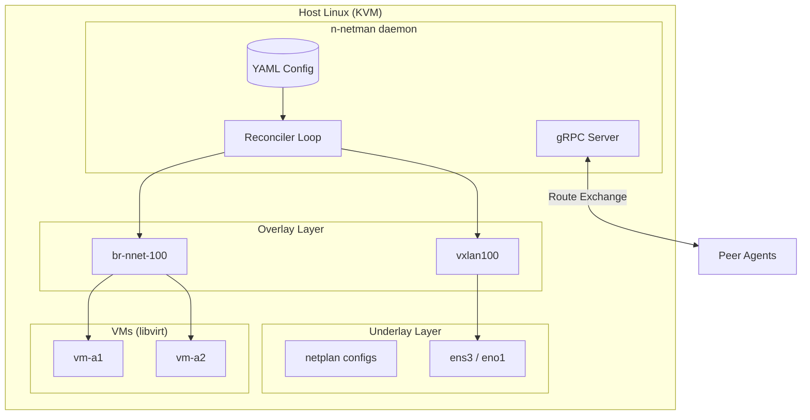
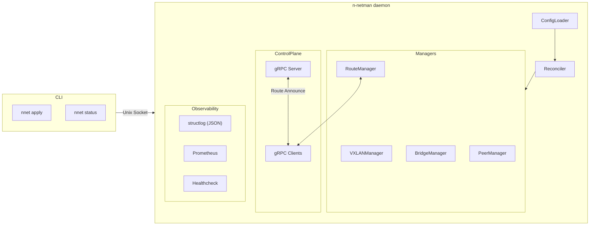
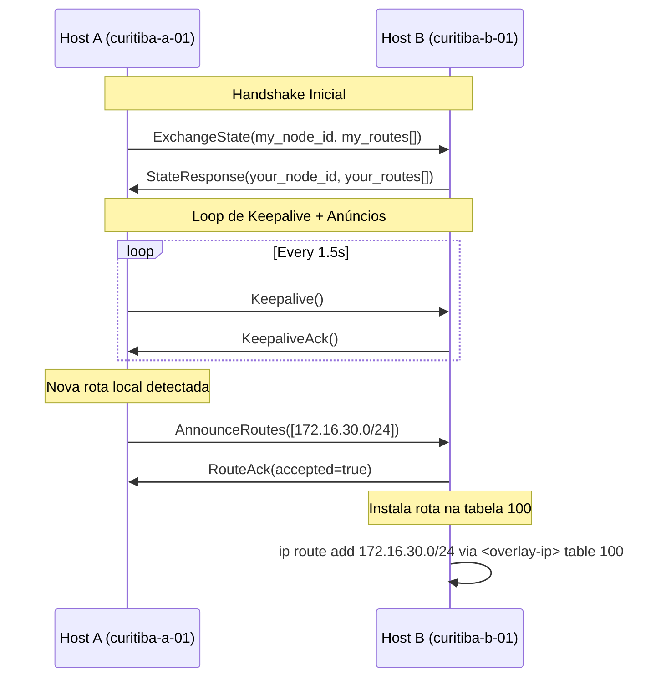

# n-netman — Plano de Implementação do MVP

## Visão Geral do Projeto

O **n-netman** é um agente leve em Go para criação e gerenciamento de overlays VXLAN L3/L2 entre hosts Linux com KVM/libvirt. Substitui soluções complexas como OVS por um control-plane minimalista e declarativo.



---

## Escopo do MVP

O MVP foca em **2-3 hosts com peers estáticos** trocando rotas via gRPC.

### ✅ Incluído no MVP
| Funcionalidade | Descrição |
|----------------|-----------|
| **Config Loader** | Parse do YAML com validação |
| **VXLAN Manager** | Criar/deletar interfaces VXLAN via netlink |
| **Bridge Manager** | Criar/deletar bridges Linux |
| **Peer Manager** | FDB entries para peers VXLAN |
| **gRPC Control Plane** | Troca de rotas entre peers |
| **Route Manager** | Instalar rotas aprendidas na tabela 100 |
| **Reconciler Loop** | Estado desejado vs. estado atual |
| **CLI básico** | `nnet apply`, `nnet status` |
| **Observabilidade** | Logs JSON, métricas Prometheus, healthcheck |

### ❌ Fora do Escopo (v1+)
- Descoberta automática de peers (mDNS/gossip)
- Attach automático de VMs  
- Transit routing entre peers
- TLS no gRPC
- Integração com FRR/BIRD

---

## Arquitetura de Componentes



---

## Estrutura do Projeto

```
n-netman/
├── cmd/
│   ├── nnetd/              # Daemon principal
│   │   └── main.go
│   └── nnet/               # CLI
│       └── main.go
├── internal/
│   ├── config/             # YAML parsing e validação
│   │   ├── config.go       # Estruturas de config
│   │   ├── loader.go       # Carregamento do YAML
│   │   └── validate.go     # Validação de schema
│   ├── netlink/            # Abstração sobre vishvananda/netlink
│   │   ├── vxlan.go        # Operações VXLAN
│   │   ├── bridge.go       # Operações Bridge
│   │   ├── route.go        # Operações de roteamento
│   │   └── fdb.go          # FDB entries
│   ├── reconciler/         # Estado desejado vs. atual
│   │   ├── reconciler.go
│   │   └── diff.go
│   ├── controlplane/       # gRPC para troca de rotas
│   │   ├── server.go
│   │   ├── client.go
│   │   └── proto/
│   │       └── nnetman.proto
│   ├── routing/            # Lógica de export/import
│   │   ├── export.go
│   │   ├── import.go
│   │   └── policy.go
│   ├── observability/      # Logs, métricas, health
│   │   ├── logger.go
│   │   ├── metrics.go
│   │   └── health.go
│   └── daemon/             # Lifecycle do daemon
│       └── daemon.go
├── api/                    # Definições proto
│   └── v1/
│       └── nnetman.proto
├── configs/                # Exemplos de configuração
│   └── n-netman.yaml
├── scripts/                # Scripts auxiliares
│   └── setup-lab.sh
├── planning/               # Artefatos de planejamento
├── go.mod
├── go.sum
├── Makefile
└── README.md
```

---

## Fases de Implementação

### Fase 1: Fundação (Semana 1)
> **Objetivo**: Estrutura do projeto + Config Loader funcional

| Item | Descrição |
|------|-----------|
| [NEW] `go.mod` | Inicializar módulo Go |
| [NEW] `internal/config/` | Estruturas e parsing YAML |
| [NEW] `cmd/nnetd/main.go` | Entry point do daemon |
| [NEW] `Makefile` | Build, test, lint |

**Dependências Go**:
```
gopkg.in/yaml.v3           # YAML parsing
github.com/go-playground/validator/v10  # Validação
```

---

### Fase 2: Netlink Core (Semana 1-2)
> **Objetivo**: Criar/deletar VXLAN e bridges programaticamente

| Item | Descrição |
|------|-----------|
| [NEW] `internal/netlink/vxlan.go` | Create/Delete/Get VXLAN |
| [NEW] `internal/netlink/bridge.go` | Create/Delete/Get Bridge |
| [NEW] `internal/netlink/fdb.go` | FDB entries para peers |
| [NEW] `internal/netlink/route.go` | Instalar rotas na tabela |

**Dependências Go**:
```
github.com/vishvananda/netlink  # Netlink bindings
github.com/vishvananda/netns    # Network namespaces
```

---

### Fase 3: Reconciler (Semana 2)
> **Objetivo**: Loop de reconciliação contínua

| Item | Descrição |
|------|-----------|
| [NEW] `internal/reconciler/` | Diff entre estado desejado e atual |
| Integração | Reconciler usa VXLANManager + BridgeManager |

**Comportamento**:
1. Carregar config desejada
2. Ler estado atual via netlink
3. Calcular diff (create/update/delete)
4. Aplicar mudanças
5. Sleep → Loop

---

### Fase 4: gRPC Control Plane (Semana 2-3)
> **Objetivo**: Troca de rotas entre peers

| Item | Descrição |
|------|-----------|
| [NEW] `api/v1/nnetman.proto` | Definição do protocolo |
| [NEW] `internal/controlplane/` | Server + Client gRPC |
| [NEW] `internal/routing/` | Lógica de export/import |

**Proto simplificado**:
```protobuf
service NNetMan {
  rpc AnnounceRoutes(RouteAnnouncement) returns (RouteAck);
  rpc ExchangeState(StateRequest) returns (StateResponse);
  rpc Keepalive(KeepaliveRequest) returns (KeepaliveResponse);
}

message RouteAnnouncement {
  string node_id = 1;
  repeated Route routes = 2;
}

message Route {
  string prefix = 1;      // "172.16.10.0/24"
  string next_hop = 2;    // Overlay IP do anunciante
  uint32 metric = 3;
  uint32 lease_seconds = 4;
}
```

---

### Fase 5: CLI (Semana 3)
> **Objetivo**: Comandos básicos de operação

| Item | Descrição |
|------|-----------|
| [NEW] `cmd/nnet/` | CLI com cobra |
| `nnet apply` | Carrega config e aplica |
| `nnet status` | Mostra peers, VXLAN, bridges |

**Dependências Go**:
```
github.com/spf13/cobra    # CLI framework
```

---

### Fase 6: Observabilidade (Semana 3)
> **Objetivo**: Logs, métricas, healthcheck

| Item | Descrição |
|------|-----------|
| [NEW] `internal/observability/` | Logger, metrics, health |
| Logs | JSON structured (slog) |
| Métricas | Prometheus endpoint `:9109` |
| Health | HTTP endpoint `:9110/healthz` |

**Dependências Go**:
```
github.com/prometheus/client_golang  # Métricas
```

---

## Protocolo de Rotas



---

## Verificação

### Testes Unitários
Como este é um projeto **novo** (greenfield), os testes serão criados junto com o código.

```bash
# Rodar todos os testes
make test

# Com cobertura
make test-coverage
```

**Áreas críticas para testes**:
- `internal/config/` — Parsing YAML, validação
- `internal/routing/` — Lógica de export/import policies

### Testes de Integração

> [!IMPORTANT]
> Testes de integração requerem **privilégios root** e um ambiente Linux com suporte a netlink.

```bash
# Rodar testes de integração (requer root)
sudo make test-integration
```

**Cenários de integração**:
1. Criar VXLAN interface e verificar com `ip link`
2. Criar bridge e attached VXLAN
3. Adicionar FDB entry e verificar com `bridge fdb`

### Teste Manual em Lab

> [!CAUTION]
> Precisa de 2-3 VMs Linux com conectividade IP entre elas.

**Setup do Lab** (Vagrant ou manual):
1. 3 hosts: `host-a` (10.10.0.11), `host-b` (10.10.0.12), `host-c` (10.10.0.13)
2. Cada host com n-netman instalado
3. Config com peers apontando para os outros

**Passos de Validação**:
1. Iniciar daemon em todos os hosts
2. Verificar criação de `vxlan100` e `br-nnet-100`
3. Verificar FDB entries com `bridge fdb show dev vxlan100`
4. Verificar troca de rotas via logs ou `nnet status`
5. Testar conectividade overlay (ping entre IPs overlay)

---

## Dependências Go (Resumo)

```go
require (
    gopkg.in/yaml.v3 v3.0.1
    github.com/go-playground/validator/v10 v10.16.0
    github.com/vishvananda/netlink v1.1.0
    github.com/vishvananda/netns v0.0.4
    github.com/spf13/cobra v1.8.0
    github.com/prometheus/client_golang v1.18.0
    google.golang.org/grpc v1.60.0
    google.golang.org/protobuf v1.32.0
)
```

---

## Próximos Passos

Após aprovação deste plano:

1. **Inicializar projeto Go** — `go mod init`, estrutura de diretórios
2. **Implementar Config Loader** — Fase 1
3. **Implementar Netlink Core** — Fase 2
4. **Testes manuais em ambiente de lab**

> [!TIP]
> Recomendo começar com um "hello world" de netlink: criar uma bridge programaticamente e verificar com `ip link`.
